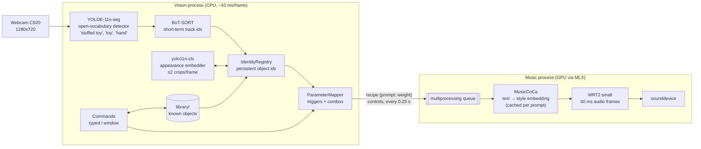
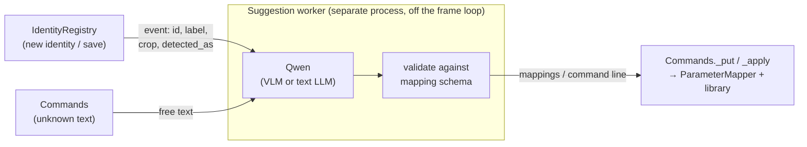

# Camera tracking architecture

How `sc-collab` (`make run`) turns webcam frames into Magenta RealTime 2 style
prompts, which models are involved, and where a local Qwen model would plug in
to map objects to sound parameters.

## Overview



Two processes on purpose: generation must never wait on vision. The vision loop
only sends small dictionaries over a queue (`superconductor/magenta_local.py`).

## Models

| Stage | Model | Runs on | Cost | Purpose |
|---|---|---|---|---|
| Detection + masks | `yoloe-11s-seg.pt` (YOLOE, open vocabulary) | CPU, 480 px | ~40 ms/frame | finds toys and hands; the class name is *not* used as identity |
| Prompt encoding (once, at startup) | `mobileclip_blt.ts` (MobileCLIP text encoder, downloaded by YOLOE) | CPU | once | turns the class prompts into detector weights |
| Short-term tracking | BoT-SORT (`botsort_superconductor.yaml`) | CPU | <1 ms | frame-to-frame track ids; ReID and camera-motion compensation off |
| Appearance embedding | `yolo11n-cls.pt` (ImageNet classifier, 256-d penultimate features) | CPU, 128 px crops | ~3 ms/crop, ≤2 crops/frame | recognizes *which* object a track is |
| Color fingerprint | HSV histogram over the YOLOE mask | CPU | negligible | second appearance cue (30% of the score) |
| Style embedding | MusicCoCa (inside MRT2) | GPU (MLX) | once per new prompt string, cached | text prompt → style vector |
| Music | Magenta RealTime 2 `mrt2_small` | GPU (MLX) | must stay < 40 ms per 40 ms frame | audio generation |

Measured on the M3 Pro: vision takes 43 ms mean and 49 ms p95 per frame, both
with and without the embedder. Embedding runs only for new tracks and for the
roughly once-per-second checks.

## Stages in detail

### 1. Detection: `object_tracking/tracker.py`

`ObjectTracker.__call__` runs YOLOE with BoT-SORT (`model.track(..., persist=True)`).

- **Output:** each detection becomes a `TrackedObject` with its box, a normalized
  center, a color histogram (masked by the segmentation polygon) and a BoT-SORT
  `track_id`.
- **Hands:** `hand` detections are split off into `tracker.hands`. They are used
  for calibration and for `held` triggers, and never become objects.
- **Prompts:** the detector is deliberately class-agnostic. `"stuffed toy"` and
  `"toy"` only have to *find* things. The prompt set and `conf = 0.25` were tuned
  on a real webcam frame, where chimchar scored 0.34 with the old `"toy"` prompt.
  `new_track_thresh` was lowered to 0.3 so that such objects still start tracks.

### 2. Identity: `object_tracking/identity.py`, `embedder.py`

BoT-SORT ids are not stable: a track dies after a long occlusion and the object
comes back with a new id, or a revived track lands on the wrong object.
`IdentityRegistry` maps tracks to permanent `Identity` objects (`#1`, `#2`, …).

**Classification on first introduction.** An unbound track collects evidence
before anything is decided:

1. It collects 8 frames of color histograms (`min_hits`) and 3 appearance
   embeddings, taken at frames 0, 3 and 6 (`samples`, `sample_every`).
2. The score against each identity is
   `0.7 · embedding similarity + 0.3 · color similarity`. Identities whose last
   box is right where the track appeared get +0.2 (`near_bonus`).
3. All ready tracks are assigned jointly to the identities not currently in view
   (Hungarian assignment), so two objects can't swap:
   - **≥ 0.55:** bound to that identity.
   - **< 0.45:** a new identity.
   - **In between:** keeps waiting. After 45 frames it goes to the best match
     above 0.45, otherwise it becomes new.

**Embedding centering.** Raw `yolo11n-cls` features of *any* two crops score
0.75–0.95 cosine similarity. The embedder therefore subtracts a scene mean,
computed from random crops of the first few frames, before comparing. On real
crops, different plushies then score about 0.4 and the same plushie about
0.7–0.9, including against crops from an earlier session.

**Verification.** Each bound track is re-embedded about once per second, and
immediately after reappearing from more than 0.5 s unseen. If it looks at least
0.15 more like another identity than its own, it is unbound and re-identified.
This catches BoT-SORT reviving a lost track on the wrong object.

**Coasting.** When an identity isn't detected in a frame, its last box is still
output (`obj.coasted = True`, drawn dashed with "last seen"). That lasts 1 s, or
indefinitely while the box is within 0.06 (of the frame width) of a detected
object. Two objects pressed together often come out of the detector as one box;
coasting keeps both present.

**Galleries.** Each identity keeps up to 12 distinct views, one embedding and
crop each; a view is only added if its similarity to all kept views is below
0.9. Views from the library are kept separately and never modified.

### 3. Object library: `object_tracking/library.py`

```
library/<name>/object.json     mappings (editable), detector votes, embedder name
library/<name>/embeddings.npy  raw features, one row per view
library/<name>/hist.npy        color fingerprint
library/<name>/views/NN.jpg    the saved crops, aligned with the embedding rows
library/combos.json            combos created with the `combine` command
```

- **At startup:** every entry becomes an identity with a name before it is ever
  seen, so a known object is recognized by name the first time it appears.
- **Adding views:** `save` (or `s` in the window) appends the views collected in
  this session.
- **Embedder changes:** embeddings made with a different embedder are ignored and
  a warning is printed. The identity then relies on color until you save it again.

### 4. Mapping: `object_tracking/mapper.py`

A `Parameter` is one thing the music can do:
- **Kind:** a style prompt, `temperature`, `top_k` or `cfg_musiccoca`.
- **Trigger:**
  - `near`: 1 at the crosshair, 0 at `max_distance`
  - `held`: a hand box covers at least 15% of the object
  - `visible`: 1 while the object is in view

Parameters come from three places:
- `collab.toml` `[[parameters]]` and `[assign]`
- library mappings (`object.json` `"mappings"`)
- typed commands (`map bulbasaur held epic strings`)

Unassigned objects claim a free, unreserved parameter.

**Combos.** When every pair of a combo's objects is within `distance` (box edge
to box edge), the members' own parameters fade to 0. The combo's parameter is
driven by the group's union box instead. They separate at
`distance · release_factor`. Example: bulbasaur + chimchar play
"friendly jungle beat" instead of flute and drums.

**Output.** `mapper.recipe()` builds `{prompt text: weight}` and
`mapper.controls()` builds the sampling overrides. `CollabFrontend.send()`
(`collab.py`) sends both at most every 0.25 s. In the music process,
`_blend_styles` embeds each prompt with MusicCoCa (cached) and mixes the style
vectors by weight.

### 5. Commands and UI: `object_tracking/commands.py`, `collab.py`

Commands can be typed in the window (`/`) or in the terminal (a stdin thread;
commands are executed on the main loop).
- **Syntax:** a small grammar (`save`, `map`, `unmap`, `combine`, `distance`,
  `show`, `forget`, `list`, `lock`, `unlock`, `reset`), plus one regex for
  phrases like `when I'm holding X play Y`.
- **Result:** everything ends up as mapping dictionaries
  (`{"trigger", "prompt" | "parameter" | "kind", "min", "max"}`), passed to
  `ParameterMapper.set_mappings` and, for library objects, `ObjectLibrary.set_mappings`.

## Where a local Qwen model would plug in

Today a human decides the mapping: they type `map …` or edit `object.json`. A
local Qwen model fits exactly one place: turning *what an object is* into *what
it should sound like*, producing the same mapping dictionaries the commands
already produce. Nothing downstream changes.



### What it would do

1. **Object → sound (text LLM, e.g. Qwen2.5-1.5B/3B-Instruct 4-bit).** When an
   identity is created or first saved, send its name and detector votes. For
   example: `{"name": "chimchar", "detected_as": {"toy": 490}}` →
   `[{"trigger": "near", "prompt": "fiery taiko drums with crackling embers"},
   {"trigger": "held", "prompt": "…"}]`.
2. **Unnamed object → description (vision-language model, e.g. Qwen2.5-VL-3B).**
   For a brand-new `#4`, send one crop from its views ("classification on first
   introduction"). Ask for a short name plus the mappings above. This replaces
   typing `save #4 <name>`.
3. **Free-form commands.** When `Commands.__call__` doesn't recognize a line
   (e.g. "make the monkey sound spicier when it's close to the frog"), ask Qwen
   to rewrite it into the existing grammar
   (`map chimchar near spicy latin percussion`). Then run it through the normal
   parser. The model only ever produces a command the app can already validate,
   so a bad generation fails as an ordinary "unknown command".

### Hook points

| Where | Existing code | Qwen hook |
|---|---|---|
| New identity created | `IdentityRegistry.update`, step 4 (`print(f"new object: identity #…")`) | append `(ident.id, ident.views[:1], ident.votes)` to an `events` list; `CollabFrontend.step` hands it to the suggester |
| Object saved | `Commands.cmd_save` | if the object has no mappings yet, request suggestions for `name` |
| Unknown command | `Commands.__call__` → `"unknown command …"` | send the line to the suggester; when the answer arrives, `run_command()` the rewritten line |
| Apply result | `Commands._put(owner, mapping)` + `Commands._apply(owner)` | unchanged; persists to `library/<name>/object.json` like a typed `map` |

### Sketch

```python
# superconductor/object_tracking/suggest.py  (proposed, not implemented)
import json, multiprocessing as mp, queue

SCHEMA_HINT = ('Reply with JSON only: {"name": str, "mappings": [{"trigger": '
               '"near"|"held"|"visible", "prompt": str}]}. Prompts are short '
               'music-style descriptions for a music generator.')

def _worker(requests, results, model_path):
    from mlx_lm import load, generate          # or llama.cpp on CPU, see below
    model, tok = load(model_path)
    while (req := requests.get()) is not None:
        msgs = [{"role": "system", "content": SCHEMA_HINT},
                {"role": "user", "content": json.dumps(req["object"])}]
        text = generate(model, tok, tok.apply_chat_template(msgs, add_generation_prompt=True),
                        max_tokens=200)
        try:
            results.put({"owner": req["owner"], **json.loads(text)})
        except json.JSONDecodeError:
            results.put({"owner": req["owner"], "error": text[:200]})

class MappingSuggester:
    """Non-blocking: request() on events, poll() once per frame."""
    def __init__(self, model_path="mlx-community/Qwen2.5-1.5B-Instruct-4bit"):
        self.requests, self.results = mp.Queue(), mp.Queue()
        self.proc = mp.Process(target=_worker, args=(self.requests, self.results, model_path),
                               daemon=True)
        self.proc.start()

    def request(self, owner, obj_info):
        self.requests.put({"owner": owner, "object": obj_info})

    def poll(self):
        try:
            return self.results.get_nowait()
        except queue.Empty:
            return None
```

In `CollabFrontend.step`, after `mapper.update(...)`:

```python
if (s := self.suggester.poll()) and "mappings" in s:
    for m in s["mappings"]:
        if m.get("trigger") in ("near", "held", "visible") and m.get("prompt"):
            self.commands._put(s["owner"], {"trigger": m["trigger"], "prompt": m["prompt"][:120]})
    self.commands._apply(s["owner"])
    self.say(f"{s['owner']}: suggested " + ", ".join(m["prompt"] for m in s["mappings"]))
```

### Keeping the music from skipping

The constraint that matters: **MRT2 already uses most of the GPU.** `mrt2_small`
must produce each 40 ms frame in under 40 ms. `mrt2_base` measured 51 ms alone.
A language model decoding on the same GPU will cause audio underruns.

- **Event-driven, never per frame.** Call Qwen on "new identity", "saved" and
  "unknown command", and cache the result in `object.json`. Each object costs
  one call in its lifetime.
- **Separate process** (like `magenta_local.py`), so neither the frame loop nor
  audio generation waits on it. Suggestions arriving 1–3 s later is fine.
- **Small and quantized.** A 1.5B–3B model in 4-bit (~1–2 GB) is enough for
  "object → short music prompt". `mlx-community/Qwen2.5-7B-Instruct-4bit` is
  already in the Hugging Face cache on this machine, but a 7B model will compete
  hard with MRT2.
- **Prefer CPU if the GPU is saturated.** llama.cpp with a Q4 GGUF of
  Qwen2.5-1.5B on the M3 Pro's performance cores generates tens of tokens per
  second. That's plenty for a ~60-token JSON answer, with zero GPU contention.
  Vision already uses the CPU, so expect a few fps less while a suggestion runs.
- **Throttle if needed.** Check `magenta.poll_stats()["rtf"]` before sending a
  request. Queue the request if real-time factor is below ~1.1.
- **New prompt strings cost one MusicCoCa embedding** in the music process the
  first time they are used (`_blend_styles` cache miss). Warming them up is
  possible by sending the new prompt at weight ~0 once.
- **Environment:** `mlx-lm` is not installed in `sc_env`, and it must be a
  release compatible with the pinned `mlx==0.31.2` (MRT2 models don't load on
  newer MLX). llama.cpp (`llama-cpp-python`) avoids that coupling entirely.

### What stays the same

The detector, tracker, embedder, library format, triggers, combos and the MRT2
interface are untouched. Qwen only produces the same mapping dictionaries a
person types today. Its output is validated (`trigger` whitelist, prompt length)
and stored in the library, where it can be reviewed with `list` or edited in
`object.json`.
